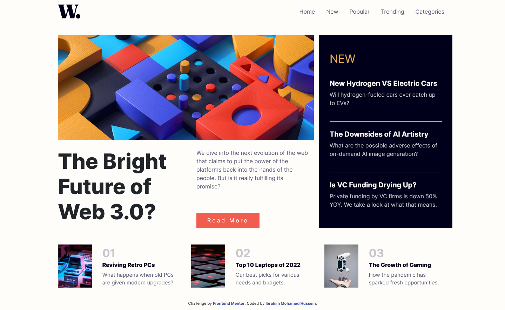

# Frontend Mentor - News homepage solution

This is a solution to the [News homepage challenge on Frontend Mentor](https://www.frontendmentor.io/challenges/news-homepage-H6SWTa1MFl). Frontend Mentor challenges help you improve your coding skills by building realistic projects.

## Table of contents

- [Overview](#overview)
  - [The challenge](#the-challenge)
  - [Screenshot](#screenshot)
  - [Links](#links)
- [My process](#my-process)
  - [Built with](#built-with)
  - [What I learned](#what-i-learned)
  - [Useful resources](#useful-resources)
- [Author](#author)

## Overview

### The challenge

Users should be able to:

- View the optimal layout for the interface depending on their device's screen size
- See hover and focus states for all interactive elements on the page
- **Bonus**: Toggle the mobile menu (requires some JavaScript)

### Screenshot

- Desktop view:



- Mobile view:


### Links

- Solution URL: [Add solution URL here](https://your-solution-url.com)
- Live Site URL: [Add live site URL here](https://Ibrahim-MohamedH.github.io/News-homepage/)

## My process

### Built with

- Semantic HTML5 markup
- CSS custom properties
- Bootstrap
- Jquery
- [WOW Animation](https://wowjs.uk/)

### What I learned

- Toggle a class to navbar on scrolling

```js
$(document).scroll(function () {
  var $nav = $(".fixed-top");
  $nav.toggleClass("scrolled", $(this).scrollTop() > 80);
});
```

### Continued development

- Getting more comfortable using Jquery and its functions.
- Understand scrolling behaviour more and how to detect scroll changes.

### Useful resources

- [Stackoverflow](https://stackoverflow.com/questions/27995621/replace-class-in-jquery) - This helped me for understanding how to replace class in Jquery.

## Author

- Website - [Ibrahim-MohamedH](https://github.com/Ibrahim-MohamedH)
- Frontend Mentor - [@Ibrahim-MohamedH](https://www.frontendmentor.io/profile/Ibrahim-MohamedH)
